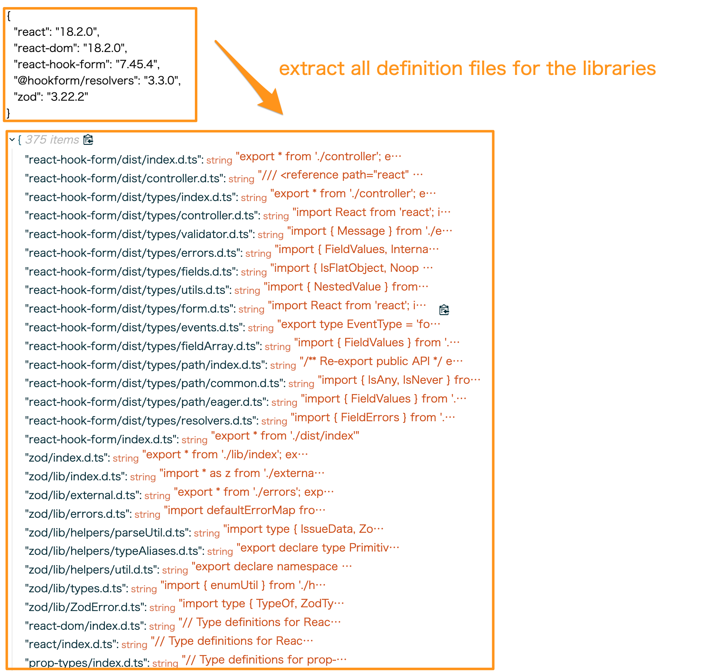

# Browser Type Resolver



## Demo Page

https://browser-type-resolver.vercel.app

## Install

```bash
npm i browser-type-resolver
```

## Usage

```ts
const dependencies = {
  "react": "18.2.0",
  "react-dom": "18.2.0",
  "react-hook-form": "7.45.4",
  "@hookform/resolvers": "3.3.0",
  "zod": "3.22.2"
}

resolveAllModuleType(dependencies).then(result => {
  console.log(result)
})
```

### Use with monaco editor

```ts
const dependencies = {
  "react": "18.2.0",
  "react-dom": "18.2.0",
  "react-hook-form": "7.45.4",
  "@hookform/resolvers": "3.3.0",
  "zod": "3.22.2"
}
const libs = await resolveAllModuleType(dependencies);
Object.entries(libs).forEach(([name, content]) => {
  monaco.languages.typescript.typescriptDefaults.addExtraLib(content, `file:///node_modules/${name}`)
})
```